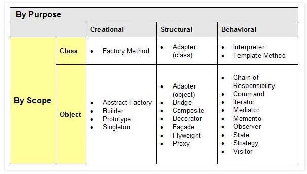
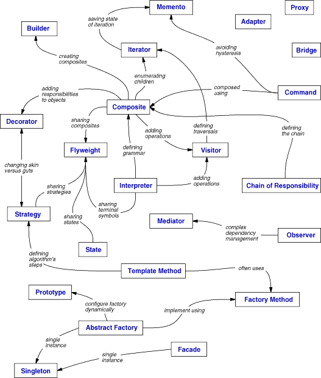
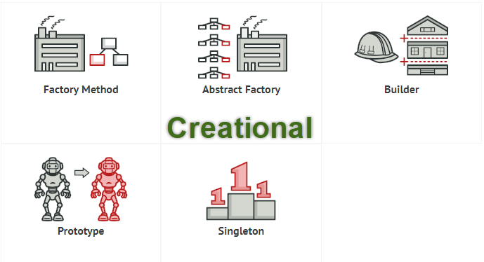

# Introduce
- Design pattern là một kỹ thuật lập trình trong lập trình hướng đối tượng
- Design pattern giúp tối ưu code, dễ dàng sử dụng, mở rộng
## Type
#### 
### Association
#### 
### Creational
#### 
### Structural 
#### 
### Behavioral
#### 
### Singleton